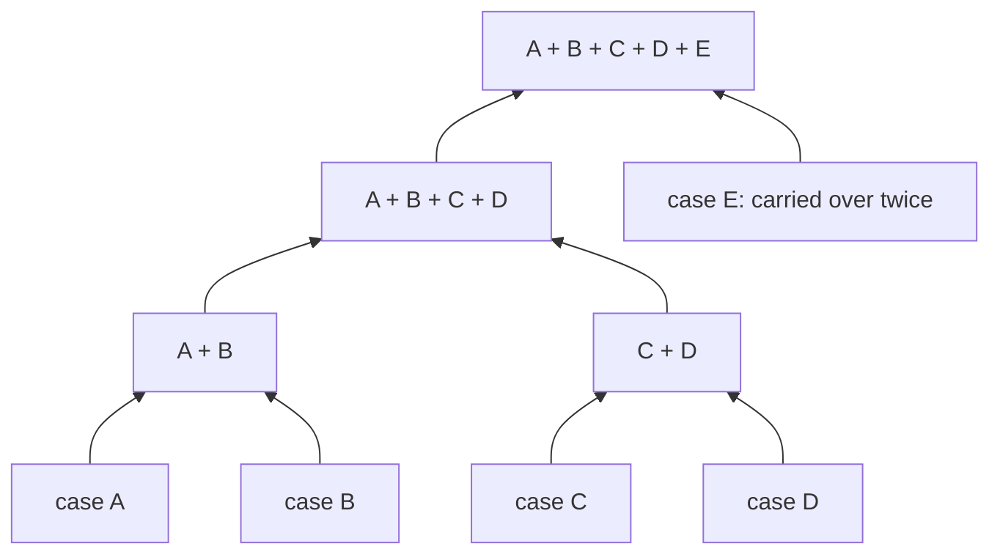

# Inter-case constraints and source placement

[Evaluation overview](../../README.md) · [Data and rule guide](../reviewer/README.md)

We add inter-case constraints to study how matching becomes harder when the
activity interpretations of several cases must be decided jointly. The
experiment starts with 116 assembly recordings, treated as separate cases.
Synthetic exclusions between candidates join connected components of the
paper's **case constraint graph**. This controls how many cases must be matched
jointly; the exclusions do not describe observed resource sharing between the
IKEA recordings.

Two parameters vary independently: **C** is the number of case components,
and **K** is the number of sources holding candidates. At a fixed C, changing K
preserves the numerical matching problem. At a fixed K, reducing C adds
exclusions while preserving every candidate's owner and original score.

## What one exclusion does

An exclusion makes one case's activity interpretation depend on the
interpretation chosen for another case. Following the paper, a **constraint**
expresses the requirement and a **row** is its encoding as an inequality over
candidate variables. A binary variable `x_v` is 1 when candidate `v` is selected.
Each added exclusion is encoded by one row, `x_g + x_f ≤ 1`, which forbids
selecting that particular pair of candidates together. They belong to
different cases, so the row adds an edge to the case constraint graph. Both
have the same owner, making this a **local row involving several cases**
(type 2 in the paper).

**Source-local** describes where the row's candidate terms are held;
**inter-case** describes which cases they belong to. A row can be both.
Single-case prerequisites and occurrence bounds can instead span sources.
Those shared rows contribute interface variables to distributed matching.

Adding an inter-case row merges two components, so their matching decisions
must be handled together. It does not turn that row into a shared row.
Even at C=116, with no inter-case exclusions, shared single-case rows remain
possible. C counts connected case components, not shared constraints.

## A hierarchy of pairwise merges

The [frozen seed-0 plan](../../inputs/provenance/plan_seed0.json.gz) starts
with a shuffled list of the 116 cases. It pairs adjacent components, adds one
exclusion between each pair, and repeats on the resulting list of components.
If a level has an odd number of components, the final unpaired component
passes unchanged to the next level; no exclusion is added for that carryover.

This small illustration uses five invented case names. Each joining box means
one merge and one new exclusion; its two incoming arrows show membership.

The binary structure describes the **merge history**. Intermediate boxes are
groups of existing cases, not new cases. The actual case constraint graph is a forest:
each merge adds one edge between previously disconnected components. It need
not be a binary tree on case vertices, because one case can supply different
observations to several merges. Component sizes also need not all be equal.

The saved 116-case hierarchy has seven levels. The paper's C settings are the
level boundaries below; the generator also supports stopping partway through
a level. Taking the first `116 − C` saved rows always leaves C components.

| Completed merge levels | Components C | New exclusions at this level | Total exclusions / case edges |
| ---: | ---: | ---: | ---: |
| 0 | 116 | 0 | 0 |
| 1 | 58 | 58 | 58 |
| 2 | 29 | 29 | 87 |
| 3 | 15 | 14 | 101 |
| 4 | 8 | 7 | 108 |
| 5 | 4 | 4 | 112 |
| 6 | 2 | 2 | 114 |
| 7 | 1 | 1 | 115 |

For example, 29 components become 15 through 14 merges and one carryover.
The full plan is fixed first. Each C setting takes a prefix of that same
ordered list; it does not draw a new graph.

## Choosing candidates for inter-case constraints

We join two components by adding a constraint that forbids selecting one
candidate from each component together. We choose the pair so that the GT
selection remains feasible and the new constraint rules out a previously
feasible selection.

Matching turns observations into activity-level events in a case's trace.
Each candidate proposes an activity for one observation; selecting it accepts
that interpretation. The **GT candidate** proposes the annotated activity,
and the **GT selection** selects that candidate at every observation. Here it
provides a known feasible selection, meaning that it satisfies all rows.
Matching itself permits at most one candidate per observation, so other
selections may leave observations unmatched.

The generator chooses the candidates in three steps:

1. **Check alternative candidates.** Start from the GT selection. For one
   observation, select a non-GT candidate instead of its GT candidate, keeping
   every other observation at GT. Record the alternative if the assignment
   rows and all original mined prerequisites and occurrence bounds still
   hold. Repeat this check separately for every non-GT candidate.
2. **Choose two observations.** Randomly choose one observation from each
   component being joined. Both must have at least one alternative checked
   in step 1. Neither observation may have been used in an earlier added
   inter-case constraint.
3. **Add the constraint.** Randomly choose which observation supplies its GT
   candidate `g`. From the other observation, randomly choose a checked
   non-GT candidate `f`. Add the row `x_g + x_f ≤ 1`: at most one of these
   two candidates may be selected.

These choices use the fixed random seed 0. Each observation is used in at
most one added exclusion, while all its candidates remain available for
matching. The source placement described below assigns both observations
to the same source, making the added row local (type 2). Candidate activities,
scores and intervals stay fixed.

The figure shows how the new constraint restricts the possible activity
traces. In the GT selection, the illustrated case 9 observation is interpreted
as **pick up leg**. The second column changes only that interpretation to
**align leg screw with table thread**. Case 86 still selects **spin leg**,
and every other observation keeps its GT candidate. Fixed GT/non-GT labels
identify candidates; checkboxes show which candidates each selection accepts.

The GT selection satisfies the new row because it selects `g` but not `f`.
Selecting `f` instead of its observation's GT candidate selects both `g` and
`f`, violating `x_g + x_f ≤ 1`. All other rows still hold: step 1 checked the
original constraints, and no other added constraint uses the changed
observation. Thus, each added constraint rules out a previously feasible
selection while keeping GT feasible.

GT is used to prepare and check the experiment. Each matcher starts without
a GT selection. The effect of the added constraints on the optimal score and
matching time is a separate empirical question.

Check the illustrated example in the saved data

Row `bridge:000000` uses these candidates:

| Role | Case | Candidate | Activity |
| --- | ---: | --- | --- |
| GT candidate `g` | 86 | `v004874` | spin leg |
| Non-GT candidate `f` | 9 | `v005001` | align leg screw with table thread |
| GT candidate replaced by `f` | 9 | `v005002` | pick up leg |

The row is `x_v004874 + x_v005001 ≤ 1`. Its left-hand side is 1 for GT and
2 after the replacement. The other rows remain satisfied. Both observations
belong to source 3 at K=8.

The [manual review guide](../MANUAL_REVIEW.md#3-check-one-synthetic-link-and-an-ownership-change)
links to the saved records. The [illustration generator](../../reviewer/coupling.py)
checks the example before drawing it; run `python -m reviewer.coupling` to
regenerate the figure.

## Assigning observations to sources

We assign observations to eight sources after constructing the complete set
of 115 inter-case constraints. The two observations involved in each added
constraint are assigned together. Every other observation is assigned
individually. All candidates of an observation stay with that observation.
This makes every added inter-case constraint a local row involving several
cases (type 2).

The generator processes these pairs and individual observations in random
order. Each is assigned to the source currently holding the fewest candidates;
ties go to the lowest source ID. For fewer sources, we combine the original
eight sources, whose IDs run from 0 to 7:

| Source count K | Groups of original sources combined |
| ---: | --- |
| 4 | 0–1, 2–3, 4–5, 6–7 |
| 2 | 0–3, 4–7 |
| 1 | 0–7 |

The paired observations always stay together. At a fixed K, reducing the
component count C adds constraints without moving observations. Even C=116,
which has no inter-case constraints, uses the placement prepared for the full
set of 115 constraints. This placement is synthetic.

**Case agents are assigned separately.** A candidate's owner stores that
candidate; a case-agent host runs the agent responsible for the case. The
hosts are assigned independently of candidate ownership and remain fixed
across C. A local row therefore does not imply that all construction messages
stay at one source.

## Reusing the generated inter-case constraints

We construct and check the inter-case constraints using all 41 mined
prerequisites and 32 occurrence bounds. The evaluation then uses only three
prerequisites and two occurrence bounds, selected for practical runtime as
explained in the [data guide](../reviewer/README.md#why-only-five-rules-are-used-for-matching).
The inter-case constraints, candidate scores and source assignments are
retained. We check again that GT remains feasible and that each added row
excludes a selection satisfying all other rows.

The [preparation checks](../../results/benchmark_sweep/preparation/validation.json)
cover all 32 configurations, including unchanged candidate ownership across C
and identical numerical matching problems across K. The recorded
[instance-construction code](../../results/benchmark_sweep/implementation_snapshot/minea_ikea/instances.py)
and [sweep preparation](../../results/benchmark_sweep/implementation_snapshot/sweep_instances.py)
provide the full implementation details.
