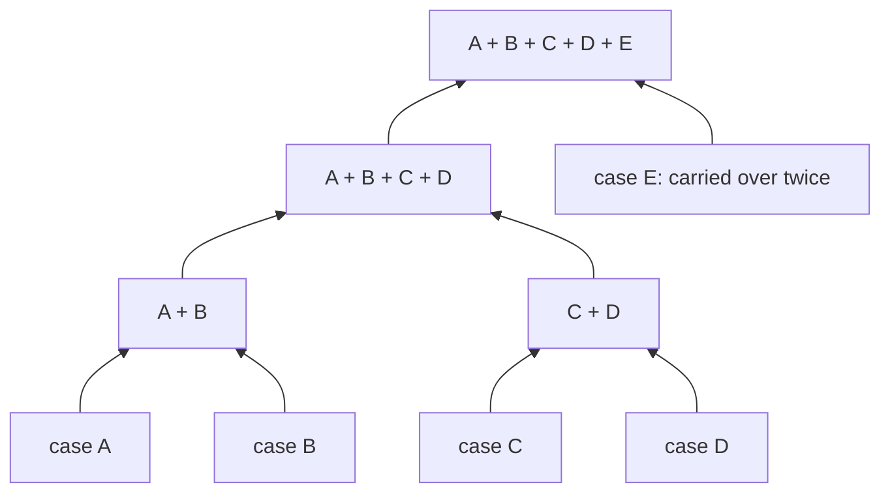

# Inter-case constraints and source placement

[Evaluation overview](../../README.md) · [Data and rule guide](../reviewer/README.md)

We add inter-case constraints to study how matching becomes harder when the
activity interpretations of several cases must be decided jointly. The
experiment starts with 116 assembly recordings, treated as separate cases.
Synthetic exclusions between candidates join connected components of the
paper's **case constraint graph**. This controls how many cases must be matched
jointly; the exclusions do not describe observed resource sharing between the
IKEA recordings.

Two parameters vary independently: **C** is the number of case components,
and **K** is the number of sources holding candidates. At a fixed C, changing K
preserves the numerical matching problem. At a fixed K, reducing C adds
exclusions while preserving every candidate's owner and original score.

## What one exclusion does

An exclusion makes one case's activity interpretation depend on the
interpretation chosen for another case. Following the paper, a **constraint**
expresses the requirement and a **row** is its encoding as an inequality over
candidate variables. A binary variable `x_v` is 1 when candidate `v` is selected.
Each added exclusion is encoded by one row, `x_g + x_f ≤ 1`, which forbids
selecting that particular pair of candidates together. They belong to
different cases, so the row adds an edge to the case constraint graph. Both
have the same owner, making this a **local row involving several cases**
(type 2 in the paper).

**Source-local** describes where the row's candidate terms are held;
**inter-case** describes which cases they belong to. A row can be both.
Single-case prerequisites and occurrence bounds can instead span sources.
Those shared rows contribute interface variables to distributed matching.

Adding an inter-case row merges two components, so their matching decisions
must be handled together. It does not turn that row into a shared row.
Even at C=116, with no inter-case exclusions, shared single-case rows remain
possible. C counts connected case components, not shared constraints.

## A hierarchy of pairwise merges

The [frozen seed-0 plan](../../inputs/provenance/plan_seed0.json.gz) starts
with a shuffled list of the 116 cases. It pairs adjacent components, adds one
exclusion between each pair, and repeats on the resulting list of components.
If a level has an odd number of components, the final unpaired component
passes unchanged to the next level; no exclusion is added for that carryover.

This small illustration uses five invented case names. Each joining box means
one merge and one new exclusion; its two incoming arrows show membership.

The binary structure describes the **merge history**. Intermediate boxes are
groups of existing cases, not new cases. The actual case constraint graph is a forest:
each merge adds one edge between previously disconnected components. It need
not be a binary tree on case vertices, because one case can supply different
observations to several merges. Component sizes also need not all be equal.

The saved 116-case hierarchy has seven levels. The paper's C settings are the
level boundaries below; the generator also supports stopping partway through
a level. Taking the first `116 − C` saved rows always leaves C components.

| Completed merge levels | Components C | New exclusions at this level | Total exclusions / case edges |
| ---: | ---: | ---: | ---: |
| 0 | 116 | 0 | 0 |
| 1 | 58 | 58 | 58 |
| 2 | 29 | 29 | 87 |
| 3 | 15 | 14 | 101 |
| 4 | 8 | 7 | 108 |
| 5 | 4 | 4 | 112 |
| 6 | 2 | 2 | 114 |
| 7 | 1 | 1 | 115 |

For example, 29 components become 15 through 14 merges and one carryover.
The full plan is fixed first. Each C setting takes a prefix of that same
ordered list; it does not draw a new graph.

## Choosing candidates for inter-case constraints

We join two components by adding a constraint that forbids selecting one
candidate from each component together. We choose the pair so that the GT
selection remains feasible and the new constraint rules out a previously
feasible selection.

Matching turns observations into activity-level events in a case's trace.
Each candidate proposes an activity for one observation; selecting it accepts
that interpretation. The **GT candidate** proposes the annotated activity,
and the **GT selection** selects that candidate at every observation. Here it
provides a known feasible selection, meaning that it satisfies all rows.
Matching itself permits at most one candidate per observation, so other
selections may leave observations unmatched.

The generator chooses the candidates in three steps:

1. **Check alternative candidates.** Start from the GT selection. For one
   observation, select a non-GT candidate instead of its GT candidate, keeping
   every other observation at GT. Record the alternative if the assignment
   rows and all original mined prerequisites and occurrence bounds still
   hold. Repeat this check separately for every non-GT candidate.
2. **Choose two observations.** Randomly choose one observation from each
   component being joined. Both must have at least one alternative checked
   in step 1. Neither observation may have been used in an earlier added
   inter-case constraint.
3. **Add the constraint.** Randomly choose which observation supplies its GT
   candidate `g`. From the other observation, randomly choose a checked
   non-GT candidate `f`. Add the row `x_g + x_f ≤ 1`: at most one of these
   two candidates may be selected.

These choices use the fixed random seed 0. Each observation is used in at
most one added exclusion, while all its candidates remain available for
matching. The source placement described below assigns both observations
to the same source, making the added row local (type 2). Candidate activities,
scores and intervals stay fixed.

The figure shows how the new constraint restricts the possible activity
traces. In the GT selection, the illustrated case 9 observation is interpreted
as **pick up leg**. The second column changes only that interpretation to
**align leg screw with table thread**. Case 86 still selects **spin leg**,
and every other observation keeps its GT candidate. Fixed GT/non-GT labels
identify candidates; checkboxes show which candidates each selection accepts.

**The GT selection remains feasible because it selects only one of the two
candidates in the new row:** `x_g = 1` and `x_f = 0`. Using two GT candidates
for the exclusion would reject the GT selection.

**The row adds a restriction because the single replacement violates this row
and no other.** After the change, `x_g = x_f = 1`, so the row's left-hand side
is 2. The original rows still hold because we checked that replacement in
step 1. All other added exclusions still hold because none involves the
changed observation. Removing this row would therefore make the changed
selection feasible. The saved plan records the removed and replacement
candidate IDs so this check, called a *nonredundancy witness*, can be
reconstructed from GT.

**This check establishes that each row excludes an otherwise feasible
selection.** Its effect on the optimal score or matching time is an empirical
question; the feasibility check does not measure these effects.
The exclusions are synthetic and do not imply that these IKEA activities
actually compete for a resource. GT is used to construct and check the
instances, not supplied as a warm start to either matcher.

**The recorded experiment reuses the exclusions built with the full mined
rule set.** The initial checks used all 41 prerequisites and 32 occurrence
bounds: 3,178 of 3,712 non-GT candidates were permitted single replacements,
covering 1,723 observations, with at least seven such observations per case.
The 115 exclusions use 230 distinct observations. The sweep retains the same
exclusions when reducing the mined rules to three prerequisites and two
occurrence bounds, and checks every witness again. No cases or candidates
are removed by these checks.

### IDs for checking the illustrated example

The first shuffled pair is cases 9 and 86. Row `bridge:000000` uses the
right-to-left orientation, taking the GT endpoint from case 86:

| Role | Case | Observation | Candidate | Activity |
| --- | ---: | --- | --- | --- |
| GT candidate `g` in the added row | 86 | `case86:frames2183-2709` | `v004874` | spin leg |
| Non-GT candidate `f` in the added row | 9 | `case9:frames643-665` | `v005001` | align leg screw with table thread |
| GT candidate removed for the check | 9 | `case9:frames643-665` | `v005002` | pick up leg |

Its row is `x_v004874 + x_v005001 ≤ 1`. GT gives left-hand side 1.
The witness removes `v005002` and selects `v005001`, giving left-hand side 2.
All other original and synthetic rows still hold. The frame numbers locate
observations within their respective recordings; the exclusion does not
compare the recordings' times.

See the plan's first `bridges` entry and the
[K8/C58 instance](../../results/benchmark_sweep/preparation/instances/seed0_K8_C58.json.gz).
Both endpoint observations, including all three alternatives at each, belong
to source 3 at K=8. The next section explains why this stays local at every K.

The [illustration generator](../../reviewer/coupling.py) checks this example
against the saved full model and the instance with all 115 exclusions before
drawing it. Regenerate the SVG with `python -m reviewer.coupling`.

## Fixed candidate placement and source coarsening

Placement uses the **entire 115-row plan**, including rows absent from shorter
prefixes. Each pair of endpoint observations forms one ownership block.
Every remaining observation forms a singleton block: 115 pairs plus 1,626
singletons give 1,741 blocks covering all 1,856 observations.

The generator shuffles the blocks with the same seeded random generator,
then places each block at the source currently holding the fewest candidates;
ties go to the lowest source ID. All alternatives of an observation stay
together. A paired block contains six candidates and a singleton contains
three, so balancing counts candidates rather than blocks. Saved K=8 loads,
in source-ID order, are `696, 699, 696, 696, 696, 696, 696, 693`.

Source IDs start at zero. Smaller source layouts combine contiguous groups
of the eight saved sources using `owner_K = owner_8 // (8 // K)`:

| Saved source at K=8 | Source at K=4 | Source at K=2 | Source at K=1 |
| ---: | ---: | ---: | ---: |
| 0 | 0 | 0 | 0 |
| 1 | 0 | 0 | 0 |
| 2 | 1 | 0 | 0 |
| 3 | 1 | 0 | 0 |
| 4 | 2 | 1 | 0 |
| 5 | 2 | 1 | 0 |
| 6 | 3 | 1 | 0 |
| 7 | 3 | 1 | 0 |

The example's owner therefore becomes 3, 1, 0 and 0 at K=8,4,2,1.
Both endpoints always move together. Within any K, changing C moves no
candidates: even C=116 retains the placement determined by the full plan.
This allocation is synthetic, not a reconstruction of an IKEA deployment.

## Case-agent hosts are a separate assignment

A candidate's owner stores that candidate. A case-agent host runs the agent
responsible for a case; it is not the owner of every candidate in that case.
The plan cycles lexicographically sorted case IDs through eight hosts, then
coarsens hosts with the same integer-division rule as sources. Hosting remains
fixed across C and is assigned independently of candidate placement.

In the example at K=8, case 86's agent is on host 5 and case 9's agent on
host 1, although the exclusion's candidates are both on source 3. The case
edge still connects those agents. Component election chooses the smallest
`(host, case ID)` rank, so this two-case component's coordinator is on host 1.
Local storage of the exclusion does not imply that all associated protocol
messages stay on one host.

## What is frozen for the five-template sweep

The plan and its safe swaps were originally checked against all 41 mined
prerequisites and 32 occurrence bounds. Preparation first validates that
original plan, builds its prefixes and source layouts, then retains only
`pre_019`, `pre_036`, `pre_023`, `occ_031` and `occ_021` from the saved
[selection protocol](../../inputs/provenance/selection_protocol.json).
It does not regenerate endpoints, bridges, witnesses, placement or scores.
Removing templates preserves the original witnesses; preparation also checks
all 115 witnesses explicitly against the reduced model.

The [preparation audit](../../results/benchmark_sweep/preparation/validation.json)
records all 32 conditions, GT feasibility, `116 − C` edges, identical numerical
models across K, fixed ownership across C and the witness checks. The code
recorded with the executed sweep contains
[`generate_plan`, `validate_plan` and `build_instance`](../../results/benchmark_sweep/implementation_snapshot/minea_ikea/instances.py)
and [sweep preparation](../../results/benchmark_sweep/implementation_snapshot/sweep_instances.py).
The standalone [instance generator](../../minea_ikea/instances.py) is identical;
the [sweep preparation runner](../../sweep_instances.py) changes only five input
paths for this project folder. The input plan and preparation's
[saved plan copy](../../results/benchmark_sweep/preparation/plan_seed0.json.gz)
are byte-identical.

For a manual check, trace the three candidate IDs above, evaluate its row under
GT and the recorded single swap, and inspect the unchanged other rows. Compare
K2/C116 with K2/C58 for unchanged ownership, then K2/C58 with K8/C58 for the
division-by-four mapping. The [manual review guide](../MANUAL_REVIEW.md#3-check-one-synthetic-link-and-an-ownership-change)
provides the corresponding artifact links; the [data guide](../reviewer/README.md)
explains the observations, GT assistance and mined templates underlying them.
