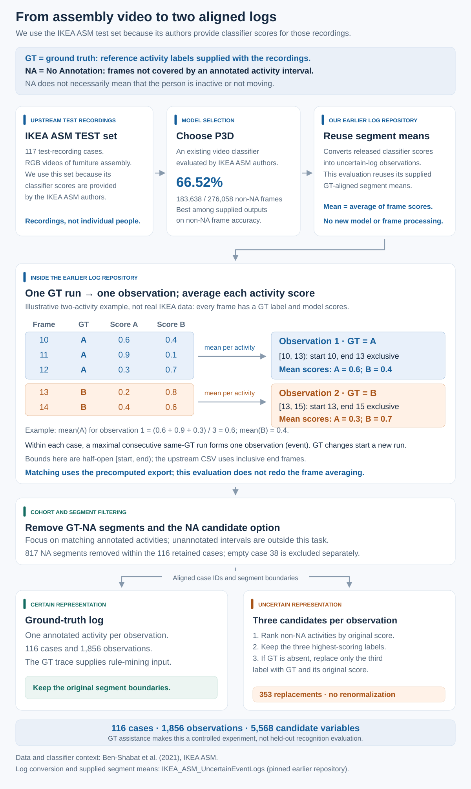
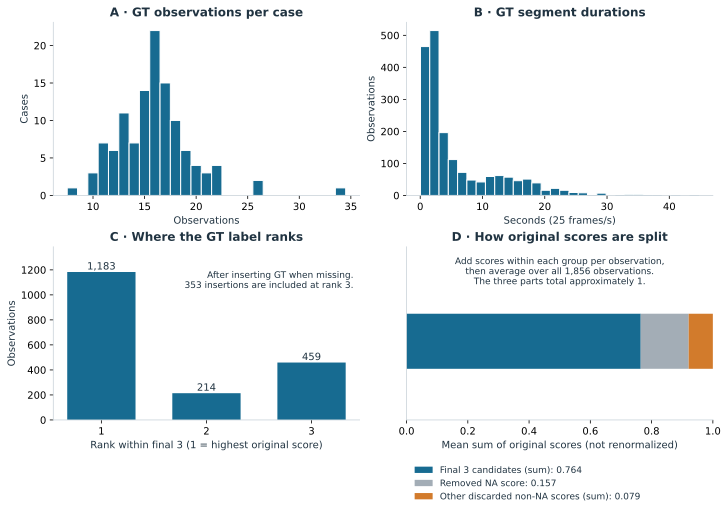
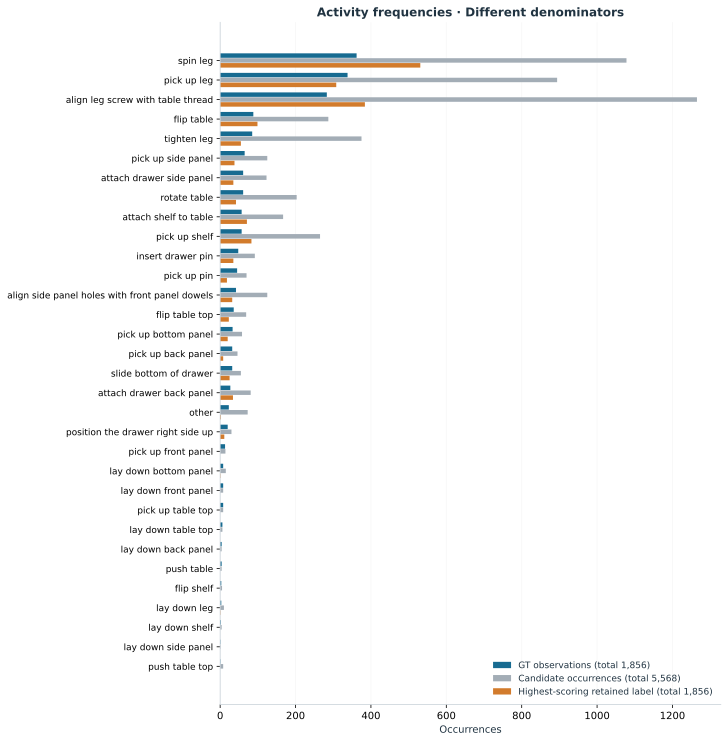
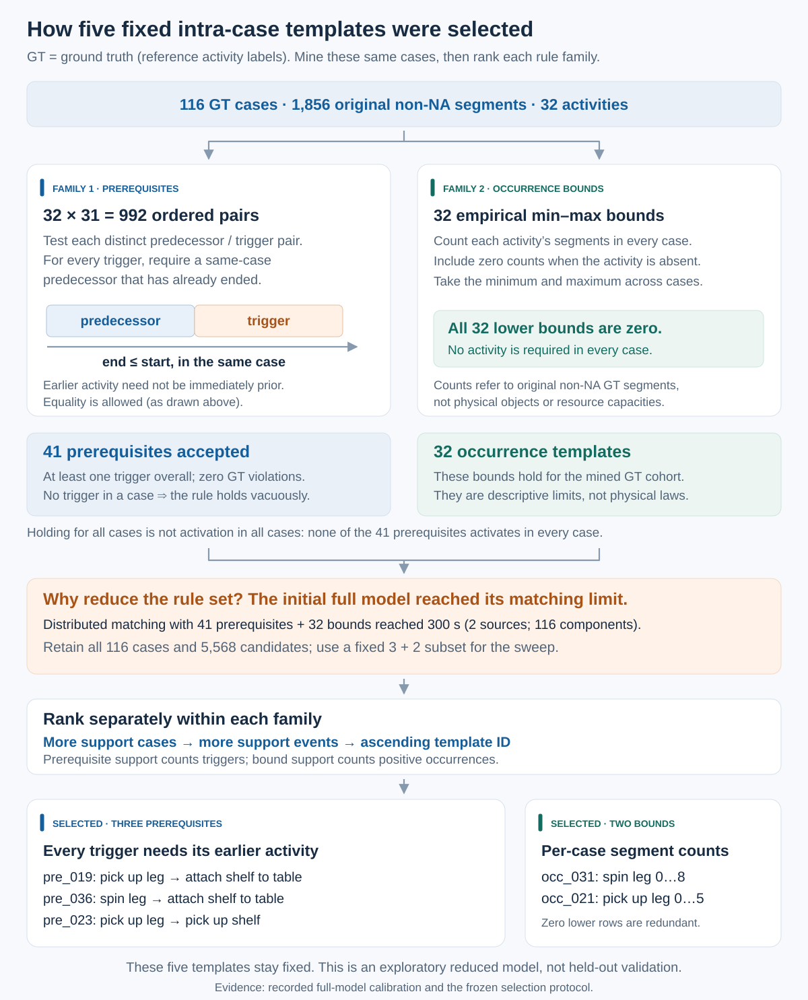
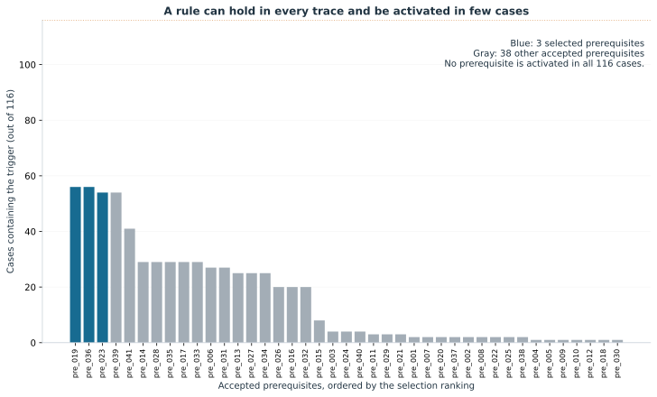

# Data preparation and mined rules

From classifier-scored video segments to a controlled matching experiment. Ground truth (GT) means the reference activity annotations supplied with IKEA ASM: which activity occurs, and when. This guide explains how these annotations and model scores become matching inputs; every numerical table is generated from the included evidence.

[Main README · setup and running the code](../../README.md) · [Next: inter-case constraints and source placement](../../docs/coupling/README.md) · [HTML version of this guide](index.html) · [All rule definitions](RULES.md) · [Metric definitions](DATA_DICTIONARY.md) · [Data sources and citations](../../docs/SOURCES.md) · [BibTeX references](../../references.bib)

| Cases | GT observations | Candidate alternatives | GT case variants | Mined / used templates |
| --- | --- | --- | --- | --- |
| 116 | 1,856 | 5,568 | 103 | 73 / 5 |

GT defines the observations, ensures the reference activity is among their candidates, and supplies the traces from which we mine rules. We use this same set of cases throughout. These choices let us study matching under controlled conditions; the results do not measure recognition on unseen videos or show that the rules hold for unseen assemblies.

## 1. How the two logs were created

### The original dataset and our earlier uncertain log

The IKEA ASM dataset by Ben-Shabat et al. (WACV 2021) records people assembling furniture. We use its test dataset: 117 assembly recordings for which the dataset authors provide classifier scores. This is why we use the test set for this experiment. One recording is one case; 117 is a count of test cases, not distinct people or the entire IKEA ASM dataset.

[IKEA ASM paper · Ben-Shabat et al. (2021)](https://openaccess.thecvf.com/content/WACV2021/html/Ben-Shabat_The_IKEA_ASM_Dataset_Understanding_People_Assembling_Furniture_Through_Actions_WACV_2021_paper.html) · [IKEA ASM website](https://ikeaasm.github.io/) · [Original authors' repository](https://github.com/IkeaASM/IKEA_ASM_Dataset)

Our earlier IKEA_ASM_UncertainEventLogs repository converts these frame-level predictions and annotations into event logs. It keeps possible activity labels and their scores, giving the candidates needed by our matching model. We reuse its GT-aligned export. ‘GT-aligned’ means that changes in the reference activity label determine where observations start and end, as explained below.

[Our uncertain-log repository](https://github.com/henrikkirchmann/IKEA_ASM_UncertainEventLogs) · [Earlier work · Kirchmann et al. (2026)](https://doi.org/10.1007/s44311-026-00055-7) · [Exact export version](https://github.com/henrikkirchmann/IKEA_ASM_UncertainEventLogs/tree/f8403649a508584d661edee3b8fb0c231f6c7a78)

### Why P3D scores are available

P3D is an existing video activity-recognition model evaluated by the IKEA ASM authors. Our earlier repository reuses their released predictions for the test recordings. We selected P3D because it has the highest frame accuracy after excluding GT-NA frames among the ten supplied model exports: 66.52%. We reuse the supplied segment averages without training a classifier or rerunning video inference. This combination of a real assembly process, scored candidates and reference labels is why the dataset is useful for this matching experiment.

[Authors' action-recognition benchmark](https://github.com/IkeaASM/IKEA_ASM_Dataset/tree/master/action) · [Recorded ten-model comparison](../../inputs/reference/model_selection.csv)

### GT-aligned export: from frames to observations

1. Start with the frames of one test recording in time order. Each frame has a GT activity label and a classifier score for each possible activity.
2. Collect consecutive frames with the same GT label into one segment. A change in GT starts a new segment, even if the classifier's highest-scoring activity does not change. A later return to the same GT label is a separate segment.
3. Represent the segment as one event, called an observation in the matching model. Its case is the recording, its GT activity is the shared label, and its start and end come from the first and last frames in the segment.
4. For each possible activity separately, add its classifier scores over all frames in the segment and divide by the number of frames. This gives that activity's candidate score for the observation. Average the full score vector before choosing the retained candidates.
5. Write two aligned logs. The GT log records the observation with its reference activity; the uncertain log records the same observation and time interval with scored candidate activities. This experiment reuses the averages already computed by our earlier repository.

Illustrative two-activity example, not an IKEA ASM measurement: frames 10–12 have GT activity A, and frames 13–14 have GT activity B. The classifier can disagree with GT within either segment.

| Frame | GT activity | Score for A | Score for B |
| --- | --- | --- | --- |
| 10 | A | 0.6 | 0.4 |
| 11 | A | 0.9 | 0.1 |
| 12 | A | 0.3 | 0.7 |
| 13 | B | 0.2 | 0.8 |
| 14 | B | 0.4 | 0.6 |

| Observation | Frames [start, end) | GT activity | Mean score for A | Mean score for B |
| --- | --- | --- | --- | --- |
| First | [10, 13) | A | (0.6 + 0.9 + 0.3) / 3 = 0.6 | (0.4 + 0.1 + 0.7) / 3 = 0.4 |
| Second | [13, 15) | B | (0.2 + 0.4) / 2 = 0.3 | (0.8 + 0.6) / 2 = 0.7 |

The earlier export stores the first and last included frame. Our prepared logs use an exclusive end: frames 10, 11 and 12 become [10, 13), with duration 3 frames. Under the supplied 25-frames-per-second convention, this is 0.40–0.52 seconds; the next observation is 0.52–0.60 seconds. Times are relative to each recording, not a shared clock across cases.

### What NA means and why we remove it

NA means ‘No Annotation’ in the original paper's activity list. It labels intervals without an annotated activity from the dataset's action set. A video also contains time outside its labelled actions; NA does not establish that the person is motionless. The separate label ‘other’ remains an activity in our logs.

[Original activity list · Table 11, activities are in "Description" column](https://arxiv.org/pdf/2007.00394v1#page=16)

We remove GT-NA observations and omit NA from the candidate activities as a simplification: we study matching activity candidates for annotated assembly observations, without also evaluating how to identify unannotated intervals. This filtering uses GT. Case 38 contains only NA and is excluded, leaving 116 cases and 1,856 observations. Removing NA does not force a selection: the matching model still permits selecting no candidate for an observation.

The repository also provides segments formed from consecutive model predictions. We use those exports to recover frame-accuracy counts, not to define this experiment's observations. Surviving GT segment boundaries and repeated activity labels are retained after NA removal. Each GT row and uncertain row has the same event ID, case and frame interval. Intervals are half-open: [start, end), with duration end − start, at 25 frames per second.

### Three candidates and a feasible GT matching

We limit each observation to three candidates for performance reasons: this limits the number of candidate variables and possible choices the matching algorithm must consider. Three is a practical setting for this controlled experiment under a fixed time budget, not a demonstrated best choice. The same candidate sets are used throughout the sweep.

For each observation, rank the non-NA activities by their original mean scores. Retain three; only if GT is absent, replace the third with the GT label at its original score. This happens in 353 of 1,856 observations (19.02%). Scores are not renormalized. The GT label is present in all final candidate sets by construction.

We keep GT to preserve a known complete feasible matching: selecting the reference activity for every observation satisfies the rules mined from GT, and the synthetic inter-case constraints are constructed to preserve that selection. Without insertion, truncating the candidates could remove part of this complete reference solution. This is a simplification for studying matching performance; neither matcher receives the GT selection as a starting solution. The model permits unmatched observations, so GT insertion is not required merely to make some selection feasible.

### A real observation, before and after GT insertion

Observation case0:frames752-780; GT is “other”, originally ranked 5 among non-NA activities. The original top three below are reconstructed from the retained scores and the recorded replacement. Full original score vectors require the pinned upstream export.

| Rank | Original top-three label | Original score | Final label | Unchanged score |
| --- | --- | --- | --- | --- |
| 1 | spin leg | 0.8421883668218341 | spin leg | 0.8421883668218341 |
| 2 | align leg screw with table thread | 0.13401620302881515 | align leg screw with table thread | 0.13401620302881515 |
| 3 | pick up leg | 0.012940730234341962 | other | 0.00028126178325952163 |

The replacement makes the reference activity available to the matcher while preserving its original low score. It does not force the matcher to choose it or increase its score.

[GT rows](../../inputs/reference/full/ground_truth.csv) · [Uncertain rows](../../inputs/reference/full/uncertain_log.csv.gz) · [Every GT insertion](../../inputs/reference/candidate_replacements.csv) · [Pinned upstream files](../../source_manifest.json)

### Download event logs

The downloads below contain this experiment's 116 cases and 1,856 observations in XES and CSV formats for process-mining tools such as PM4Py. Each observation remains one event. The GT log records the reference activity. The uncertain log uses the highest-scoring candidate as its displayed activity and keeps all three candidate activities and their unchanged scores in the probs_json payload attribute, following our earlier repository. That displayed activity is not a constrained matching result; tools must read the payload to use the alternatives.

[Download all event logs (ZIP)](downloads/ikea-asm-event-logs.zip) · [GT log (XES)](downloads/ground_truth.xes) · [Uncertain log (XES.GZ)](downloads/uncertain_log.xes.gz) · [GT log (CSV)](downloads/ground_truth.csv) · [Uncertain log (CSV)](downloads/uncertain_log.csv)

The case, activity and time mapping is already included. In XES, each trace's concept:name identifies its case and each event's concept:name gives its activity. CSV uses the corresponding PM4Py columns case:concept:name and concept:name. Both formats record time:timestamp at the exclusive segment end and lifecycle:transition as complete. The additional start_timestamp attribute gives the segment start: this is PM4Py's convention, not a standard XES extension. Event IDs, frame intervals and the uncertain log's score-mass attributes are retained as payload.

PM4Py can load the XES files directly with read_xes. The CSV headers match the default case, activity and completion-time keys of format_dataframe; the loading examples also parse start_timestamp. Reading either format does not run the matching algorithm or interpret probs_json as additional events. On GitHub, open a file and use Download raw file; the ZIP includes all four logs and loading examples.

All timestamps use elapsed video time at 25 frames per second, placed on a synthetic 1970 date. They do not show actual calendar dates or concurrency between recordings. The interval is half-open: time:timestamp − start_timestamp equals the observation duration. These downloads map the prepared experiment logs to the attributes above; the frozen experiment inputs remain unchanged.

[Loading examples and attribute descriptions](downloads/USAGE.txt) · [PM4Py's dataframe attribute conventions](https://processintelligence.solutions/app/static/api/2.7.17/api/pm4py.utils.html) · [Download contents, hashes and checks](downloads/manifest.json)

### Reusing the older event logs

The earlier repository's no-NA GT XES already has the same 116 nonempty cases, 1,856 events and within-case activity sequences. It can be reused for activity order and frequency. Its timestamps, however, encode frame numbers as seconds: frame 58 appears at 58 seconds instead of 58 / 25 = 2.32 seconds. The current exports correct that conversion and use an exclusive end frame; the activities and segments are unchanged.

The old uncertain logs cannot be substituted unchanged. The prediction-merged logs have different observation boundaries, and the GT-aligned exports retain the original activity-score vectors. This experiment uses GT-aligned observations after NA removal and keeps only three candidates, inserting GT when needed. The downloads above reuse our already prepared experiment logs, preserving these choices and the original retained scores without renormalization. We retain the earlier repository's probs_json payload name for the scores and map the case, activity and time attributes consistently across XES and CSV. These are export-format changes, not changes to the experiment.

[Earlier repository and export descriptions](https://github.com/henrikkirchmann/IKEA_ASM_UncertainEventLogs) · [Pinned original no-NA GT XES](https://github.com/henrikkirchmann/IKEA_ASM_UncertainEventLogs/blob/f8403649a508584d661edee3b8fb0c231f6c7a78/paper_event_logs/ikea_asm/split=test/gt_realisation/ikea_asm__test__gt_realisation__no_na.xes)

### Data preparation at a glance

## 2. The ground-truth log

A case is one retained assembly trace; an observation is one annotated activity segment. Durations are segment time or recording time as labeled, not participant labor time. The four furniture groups are retained together. GT case variants preserve the full ordered sequence after NA removal, including adjacent repeated labels.

There are 103 GT case variants, of which 93 occur once. Case lengths range from 8 to 34 observations. No frequent-variant filtering is applied.

| Furniture group | Cases | GT observations | Activities | GT case variants | GT insertions | Highest-score segment agreement |
| --- | --- | --- | --- | --- | --- | --- |
| Kallax Shelf Drawer | 29 | 449 | 16 | 25 | 207 | 169 / 449 (37.64%) |
| Lack Coffee Table | 28 | 456 | 15 | 26 | 49 | 329 / 456 (72.15%) |
| Lack Side Table | 30 | 451 | 12 | 27 | 47 | 333 / 451 (73.84%) |
| Lack TV Bench | 29 | 500 | 14 | 27 | 50 | 352 / 500 (70.40%) |

| Metric | N | Min | Median | Max | Mean | Population SD |
| --- | --- | --- | --- | --- | --- | --- |
| Observations per case | 116 | 8 | 16 | 34 | 16 | 3.596 |
| Whole recording per case (seconds) | 116 | 41.68 | 110.34 | 223.8 | 109.61 | 35.472 |
| Distinct activities per case | 116 | 3 | 7 | 16 | 7.6207 | 2.2463 |
| Case repeat events | 116 | 2 | 9 | 18 | 8.3793 | 3.1284 |
| Case adjacent equal pairs | 116 | 0 | 0 | 4 | 0.086207 | 0.44661 |
| Case removed NA segments | 116 | 0 | 6 | 22 | 7.0431 | 4.5626 |
| Case uncovered NA frames | 116 | 0 | 312.5 | 2,744 | 360.38 | 327.78 |
| Observation duration (frames) | 1,856 | 1 | 70 | 1,119 | 148.74 | 164.97 |
| Observation duration (seconds) | 1,856 | 0.04 | 2.8 | 44.76 | 5.9495 | 6.5988 |
| Variant case frequency | 103 | 1 | 1 | 4 | 1.1262 | 0.43354 |

N is the number of cases, observations or variants summarized in that row. Population SD describes their spread around the mean, using denominator N. All time values identify frames or seconds explicitly; the downloadable statistics retain the full detail.

[All 116 cases](data/cases.csv) · [Furniture groups](data/groups.csv) · [All GT case variants](data/variants.csv) · [Directly following activities](data/transitions.csv)

## 3. The uncertain log

Panels A and B describe the number of observations per case and their durations. Panels C and D show what the candidate-selection policy leaves in the uncertain log.

### Panel C: GT rank among the three candidates

For each observation, sort its final three candidates by their unchanged classifier scores and locate the GT activity. Rank 1 means GT has the highest score; rank 3 means it has the lowest of the three. The bars count observations: 1,183 at rank 1, 214 at rank 2 and 459 at rank 3, totaling 1,856.

The third bar includes 106 observations where GT was already third and all 353 where we inserted it after it fell outside the original top three. Thus the chart describes the prepared candidate sets after GT insertion; it is not the original classifier's top-three recognition accuracy.

### Panel D: retained and removed scores

For each observation, split the original segment-averaged scores into three sums: scores of the final three candidates, the removed NA score, and scores of all other removed activities. The bar shows the average of each sum over all 1,856 observations, with each observation weighted equally regardless of its duration. NA here is the classifier's score for NA on these retained observations, not the deleted GT-NA segments. A replaced third candidate belongs to the removed activities; an inserted GT candidate belongs to the retained three.

On average, the retained candidates account for 0.764, NA for 0.157, and the other removed activities for 0.079. Together these are approximately 1; small residuals come from rounding in the released scores. This explains why the three retained scores generally sum to less than 1: we keep their original values without renormalization. These are score sums, not percentages of observations or matching accuracy.

### Activity frequencies

[All activities](data/activities.csv) · [Every observation and its original scores](data/observations.csv) · [All score distributions](data/score_distributions.csv) · [Ten-model comparison](data/model_comparison.csv)

Model selection: recorded upstream evidence

| Metric | Value |
| --- | --- |
| Selected model | clip_based__c3d_and_p3d__p3d__pretrained |
| Models compared | 10 |
| Criterion | non_na |
| Tie breaking | Lexicographic model ID on equal integer correct-frame count. |
| Recorded selected raw non NA frame accuracy | 183,638 / 276,058 (66.522%) |
| Recorded selected raw all frame accuracy | 201,275 / 320,390 (62.822%) |
| Recorded selected segment agreement with NA allowed | 1,102 / 1,856 (59.375%) |
| Provenance | inputs/reference/model_selection.json; recorded upstream count data, ratios and subtotals recomputed. |

| Rank | Model export | Selected | Correct non-NA frames / 276,058 | Non-NA frame accuracy | All-frame accuracy |
| --- | --- | --- | --- | --- | --- |
| 1 | clip_based / c3d_and_p3d / p3d / pretrained | Yes | 183,638 | 66.52% | 62.82% |
| 2 | clip_based / i3d / dev2 / pretrained | No | 182,704 | 66.18% | 62.94% |
| 3 | clip_based / i3d / dev3 / pretrained | No | 172,793 | 62.59% | 60.16% |
| 4 | clip_based / i3d / dev1 / pretrained | No | 157,121 | 56.92% | 54.29% |
| 5 | clip_based / c3d_and_p3d / c3d / pretrained | No | 140,037 | 50.73% | 48.01% |
| 6 | pose_based / ST_GCN_64 / pretrained | No | 123,557 | 44.76% | 45.39% |
| 7 | pose_based / HCN_32 / pretrained | No | 123,313 | 44.67% | 40.71% |
| 8 | clip_based / i3d / depth / pretrained | No | 93,857 | 34.00% | 37.33% |
| 9 | frame_based / resnet50 / pretrained | No | 93,437 | 33.85% | 32.61% |
| 10 | frame_based / resnet18 / pretrained | No | 81,010 | 29.35% | 28.71% |

The model table uses recorded counts from the original 117-case release: 320,390 total frames and 276,058 non-NA frames. Case 38 contains only NA. It is omitted from the prepared cohort, whose recording-frame total is therefore smaller.

## 4. How the rules were mined

For every ordered pair of different activities A and B, inspect every GT occurrence of B. Accept A-before-B only if at least one B occurs in the cohort and every B has an A in the same case whose end frame is no later than B's start. The A need not be immediately before B, and one A can support several B events. A case without B satisfies this rule vacuously.

For each activity, count its GT segments in every retained case, including zeros. The minimum and maximum give its empirical occurrence bound. The zero minima mean no activity is mandatory in every retained trace. These describe this cohort; they are not independently validated physical assembly laws.

| Rule family | Examined / mined | Used in matching | Meaning of support |
| --- | --- | --- | --- |
| Prerequisites | 992 ordered pairs tested; 41 accepted | 3 | Cases/events containing the trigger activity |
| Occurrence bounds | 32 activities; 32 bounds | 2 | Cases/events containing the bounded activity |

### Why only five rules are used for matching

In a preliminary run with all 41 prerequisites and 32 occurrence bounds, distributed B&B reached the 300-second limit before completing the log, even with 116 independent cases and two sources. We reduced the rule set for practical runtime while retaining all 116 cases and their candidates.

Within each rule family, rank by descending supported cases, then supported events, then ascending template ID. Take the first three prerequisites and first two bounds. The same five are used by both methods and remain fixed across every source/component setting. Dropping rules changes the matching problem: the sweep evaluates this smaller constraint model, and does not show that five is the best rule count or a speedup on the original full model.

### The five rules used in the paper

| ID | Rule within each case | Supported cases / 116 | Supported GT events | Cases without the trigger/activity |
| --- | --- | --- | --- | --- |
| pre_019 | pick up leg before every attach shelf to table | 56 | 57 | 60 |
| pre_036 | spin leg before every attach shelf to table | 56 | 57 | 60 |
| pre_023 | pick up leg before every pick up shelf | 54 | 57 | 62 |
| occ_031 | 0 ≤ count(spin leg) ≤ 8 | 87 | 362 | 29 |
| occ_021 | 0 ≤ count(pick up leg) ≤ 5 | 87 | 338 | 29 |

Support measures how often a rule's activity appears, not how often the rule is correct: accepted prerequisites have zero GT violations. None is activated in all 116 cases. All 32 count minima are zero. These distinctions matter when judging how informative the rules are.

All rule-mining summary statistics

| Metric | Value |
| --- | --- |
| Cases | 116 |
| Events | 1,856 |
| Activities | 32 |
| Tested pairs | 992 |
| Accepted prerequisites | 41 |
| Rejected pairs | 951 |
| Purely vacuous pairs | 0 |
| Accepted active in all cases | 0 |
| Occurrence bounds | 32 |
| Positive minima | 0 |
| Selected IDs › Prerequisites | pre_019, pre_036, pre_023 |
| Selected IDs › Occurrence bounds | occ_031, occ_021 |
| Selected instantiated rows | 831 |
| Selected prerequisite rows | 599 |
| Selected upper rows | 232 |
| Assignment rows | 1,856 |
| Selected empty upper rows | 7 |
| Minimum accepted support cases | 1 |
| Maximum accepted support cases | 56 |

[Full rule semantics and witnesses](RULES.md) · [All 992 tested pairs](data/prerequisite_tests.csv) · [Frozen selection protocol](../../inputs/provenance/selection_protocol.json)

## 5. Every mined rule

The HTML guide supports text search and a “Selected rules only” filter. Blue rows are used in the paper. CSV files preserve all statistics, including group support and witnesses. The full catalogue remains available for provenance; unselected rules are not applied by the five-template sweep.

### All 41 prerequisites

| Rank | ID | Used? | Prerequisite A | Trigger B | Cases with B / 116 | B events | Cases without B |
| --- | --- | --- | --- | --- | --- | --- | --- |
| 1 | pre_019 | Yes | pick up leg | attach shelf to table | 56 | 57 | 60 |
| 2 | pre_036 | Yes | spin leg | attach shelf to table | 56 | 57 | 60 |
| 3 | pre_023 | Yes | pick up leg | pick up shelf | 54 | 57 | 62 |
| 4 | pre_039 | No | spin leg | pick up shelf | 54 | 57 | 62 |
| 5 | pre_041 | No | spin leg | tighten leg | 41 | 85 | 75 |
| 6 | pre_014 | No | pick up bottom panel | insert drawer pin | 29 | 48 | 87 |
| 7 | pre_028 | No | pick up side panel | insert drawer pin | 29 | 48 | 87 |
| 8 | pre_035 | No | slide bottom of drawer | insert drawer pin | 29 | 48 | 87 |
| 9 | pre_017 | No | pick up bottom panel | slide bottom of drawer | 29 | 32 | 87 |
| 10 | pre_033 | No | pick up side panel | slide bottom of drawer | 29 | 32 | 87 |
| 11 | pre_006 | No | attach drawer side panel | pick up pin | 27 | 45 | 89 |
| 12 | pre_031 | No | pick up side panel | pick up pin | 27 | 45 | 89 |
| 13 | pre_013 | No | pick up bottom panel | attach drawer back panel | 25 | 27 | 91 |
| 14 | pre_027 | No | pick up side panel | attach drawer back panel | 25 | 27 | 91 |
| 15 | pre_034 | No | slide bottom of drawer | attach drawer back panel | 25 | 27 | 91 |
| 16 | pre_026 | No | pick up side panel | align side panel holes with front panel dowels | 20 | 42 | 96 |
| 17 | pre_016 | No | pick up bottom panel | position the drawer right side up | 20 | 20 | 96 |
| 18 | pre_032 | No | pick up side panel | position the drawer right side up | 20 | 20 | 96 |
| 19 | pre_015 | No | pick up bottom panel | lay down bottom panel | 8 | 8 | 108 |
| 20 | pre_003 | No | align leg screw with table thread | push table | 4 | 4 | 112 |
| 21 | pre_024 | No | pick up leg | push table | 4 | 4 | 112 |
| 22 | pre_040 | No | spin leg | push table | 4 | 4 | 112 |
| 23 | pre_011 | No | pick up back panel | lay down back panel | 3 | 4 | 113 |
| 24 | pre_029 | No | pick up side panel | lay down back panel | 3 | 4 | 113 |
| 25 | pre_021 | No | pick up leg | lay down leg | 3 | 3 | 113 |
| 26 | pre_001 | No | align leg screw with table thread | flip shelf | 2 | 3 | 114 |
| 27 | pre_007 | No | flip table top | flip shelf | 2 | 3 | 114 |
| 28 | pre_020 | No | pick up leg | flip shelf | 2 | 3 | 114 |
| 29 | pre_037 | No | spin leg | flip shelf | 2 | 3 | 114 |
| 30 | pre_002 | No | align leg screw with table thread | lay down shelf | 2 | 2 | 114 |
| 31 | pre_008 | No | flip table top | lay down shelf | 2 | 2 | 114 |
| 32 | pre_022 | No | pick up leg | lay down shelf | 2 | 2 | 114 |
| 33 | pre_025 | No | pick up shelf | lay down shelf | 2 | 2 | 114 |
| 34 | pre_038 | No | spin leg | lay down shelf | 2 | 2 | 114 |
| 35 | pre_004 | No | align side panel holes with front panel dowels | lay down side panel | 1 | 1 | 115 |
| 36 | pre_005 | No | attach drawer side panel | lay down side panel | 1 | 1 | 115 |
| 37 | pre_009 | No | lay down back panel | lay down side panel | 1 | 1 | 115 |
| 38 | pre_010 | No | lay down front panel | lay down side panel | 1 | 1 | 115 |
| 39 | pre_012 | No | pick up back panel | lay down side panel | 1 | 1 | 115 |
| 40 | pre_018 | No | pick up front panel | lay down side panel | 1 | 1 | 115 |
| 41 | pre_030 | No | pick up side panel | lay down side panel | 1 | 1 | 115 |

### All 32 occurrence bounds

| Rank | ID | Used? | Activity | Min | Max | Positive cases / 116 | GT events | Zero-count cases |
| --- | --- | --- | --- | --- | --- | --- | --- | --- |
| 1 | occ_031 | Yes | spin leg | 0 | 8 | 87 | 362 | 29 |
| 2 | occ_021 | Yes | pick up leg | 0 | 5 | 87 | 338 | 29 |
| 3 | occ_007 | No | flip table | 0 | 3 | 84 | 88 | 32 |
| 4 | occ_001 | No | align leg screw with table thread | 0 | 5 | 72 | 283 | 44 |
| 5 | occ_005 | No | attach shelf to table | 0 | 2 | 56 | 57 | 60 |
| 6 | occ_023 | No | pick up shelf | 0 | 2 | 54 | 57 | 62 |
| 7 | occ_032 | No | tighten leg | 0 | 5 | 41 | 85 | 75 |
| 8 | occ_008 | No | flip table top | 0 | 1 | 36 | 36 | 80 |
| 9 | occ_029 | No | rotate table | 0 | 5 | 34 | 61 | 82 |
| 10 | occ_024 | No | pick up side panel | 0 | 6 | 29 | 65 | 87 |
| 11 | occ_009 | No | insert drawer pin | 0 | 3 | 29 | 48 | 87 |
| 12 | occ_019 | No | pick up bottom panel | 0 | 3 | 29 | 33 | 87 |
| 13 | occ_030 | No | slide bottom of drawer | 0 | 2 | 29 | 32 | 87 |
| 14 | occ_004 | No | attach drawer side panel | 0 | 4 | 28 | 61 | 88 |
| 15 | occ_022 | No | pick up pin | 0 | 3 | 27 | 45 | 89 |
| 16 | occ_003 | No | attach drawer back panel | 0 | 2 | 25 | 27 | 91 |
| 17 | occ_018 | No | pick up back panel | 0 | 3 | 23 | 32 | 93 |
| 18 | occ_002 | No | align side panel holes with front panel dowels | 0 | 4 | 20 | 42 | 96 |
| 19 | occ_026 | No | position the drawer right side up | 0 | 1 | 20 | 20 | 96 |
| 20 | occ_017 | No | other | 0 | 3 | 16 | 23 | 100 |
| 21 | occ_020 | No | pick up front panel | 0 | 2 | 12 | 13 | 104 |
| 22 | occ_011 | No | lay down bottom panel | 0 | 1 | 8 | 8 | 108 |
| 23 | occ_012 | No | lay down front panel | 0 | 1 | 8 | 8 | 108 |
| 24 | occ_025 | No | pick up table top | 0 | 1 | 8 | 8 | 108 |
| 25 | occ_016 | No | lay down table top | 0 | 1 | 6 | 6 | 110 |
| 26 | occ_027 | No | push table | 0 | 1 | 4 | 4 | 112 |
| 27 | occ_010 | No | lay down back panel | 0 | 2 | 3 | 4 | 113 |
| 28 | occ_013 | No | lay down leg | 0 | 1 | 3 | 3 | 113 |
| 29 | occ_006 | No | flip shelf | 0 | 2 | 2 | 3 | 114 |
| 30 | occ_014 | No | lay down shelf | 0 | 1 | 2 | 2 | 114 |
| 31 | occ_015 | No | lay down side panel | 0 | 1 | 1 | 1 | 115 |
| 32 | occ_028 | No | push table top | 0 | 1 | 1 | 1 | 115 |

[Prerequisite catalogue CSV](data/prerequisites.csv) · [Occurrence-bound catalogue CSV](data/occurrence_bounds.csv)

## 6. Where the synthetic experiment begins

The prepared logs and five rules are the inputs to the next stage. The assembly data do not supply multiple sources or constraints between cases. We add those synthetically, using a saved hierarchy of pairwise case merges and fixed source placement. The separate coupling guide explains the tree, the candidate exclusions and how the two experimental parameters vary.

Mined templates and instantiated optimization rows are different counts. A prerequisite creates one inequality for each trigger candidate in a case; an occurrence bound applies to the candidates of its activity in that case. At most one candidate may be selected per observation, and selecting none is permitted. Synthetic exclusions are separate from the 73 mined templates.

[Next: inter-case constraints and source placement](../../docs/coupling/README.md) · [Matching protocol and recorded results](../EXPERIMENT.md) · [Manual checking guide](../MANUAL_REVIEW.md) · [Paper Figure 3](../../paper_output/ikea_sweep/figures/ikea-overview.pdf) · [Recorded results](../../paper_output/ikea_sweep/REPORT.md)

## 7. Definitions, checks and downloadable evidence

Input consistency and arithmetic checks

| Metric | Value |
| --- | --- |
| Status | PASS |
| Aligned observations checked | 1,856 |
| Case intervals nonoverlapping | Yes |
| Positive half open durations | Yes |
| Candidate count exactly three | Yes |
| GT present after insertion | Yes |
| Replacement records checked | 353 |
| Raw score tokens preserved | Yes |
| Score unit mass tolerance | 1/1000000 |
| Reported retained mass tolerance | 1/1000000000000 |
| Maximum absolute score unit mass residual exact | 729358118377/5000000000000000000 |
| Maximum absolute score unit mass residual | 1.4587e-07 |
| Maximum reported retained mass error exact | 89/500000000000000000 |
| Maximum reported retained mass error | 1.78e-16 |
| Cross checks › Occurrence counts by case.csv › Status | PASS |
| Cross checks › Occurrence counts by case.csv › Cases | 116 |
| Cross checks › Occurrence bounds.csv › Status | PASS |
| Cross checks › Occurrence bounds.csv › Activities | 32 |
| Cross checks › Candidate coverage.csv › Status | PASS |
| Cross checks › Candidate coverage.csv › Observations | 1,856 |
| Cross checks › Model selection.csv › Status | PASS |
| Cross checks › Model selection.csv › Models | 10 |
| Cross checks › Summary.json › Status | PASS |
| Cross checks › Summary.json › Fields | case_count, event_count, activity_count, candidate_count, gt_replacement_count, removed_na_segments, process_groups, total_variant_count |

Independent rule recomputation checks

| Metric | Value |
| --- | --- |
| All pair tests match frozen audit | Yes |
| All bounds match frozen audit | Yes |
| Catalogue matches recomputed acceptance | Yes |
| Rankings and five rule selection match | Yes |
| Candidate semantics match prepared uncertain log | Yes |
| Selected rows match frozen central rows | Yes |

| File | Rows | Contents |
| --- | --- | --- |
| activities.csv | 32 | One row per GT or pre/post-insertion candidate activity; occurrences, coverage, durations and group breakdowns. |
| cases.csv | 116 | One row per retained case; trace, interval, repetition and prediction statistics. |
| groups.csv | 4 | One row per furniture/process group in the retained cohort. |
| model_comparison.csv | 10 | Recorded upstream model counts and recomputed ratios; distinct from segment-weighted agreement. |
| observations.csv | 1,856 | Aligned observations with original score tokens and reconstructed pre-insertion top3. |
| occurrence_bounds.csv | 32 | Every empirical count bound, support and witnesses |
| prerequisite_tests.csv | 992 | All accepted and rejected ordered activity pairs |
| prerequisites.csv | 41 | Every accepted prerequisite, support and witnesses |
| score_distributions.csv | 12 | Original-score, mass and rank distributions; no renormalization or entropy. |
| transitions.csv | 133 | Directly adjacent retained GT activity pairs, including self pairs. |
| variants.csv | 103 | GT case variants: ordered activity sequences, including repeated adjacent labels, with case memberships. |

[activities.csv](data/activities.csv) · [cases.csv](data/cases.csv) · [groups.csv](data/groups.csv) · [model_comparison.csv](data/model_comparison.csv) · [observations.csv](data/observations.csv) · [occurrence_bounds.csv](data/occurrence_bounds.csv) · [prerequisite_tests.csv](data/prerequisite_tests.csv) · [prerequisites.csv](data/prerequisites.csv) · [score_distributions.csv](data/score_distributions.csv) · [transitions.csv](data/transitions.csv) · [variants.csv](data/variants.csv) · [Complete log statistics JSON](data/log_stats.json) · [Complete rule statistics JSON](data/rule_stats.json)

Regenerate the entire guide with: python review.py. Install requirements-figures.txt for its vector charts. The report reads only included local evidence and does not rerun matching. Every input hash and metric definition is retained with the generated statistics; the guide has its own file manifest. Automated consistency checks do not replace an author's manual review.

[Metric definitions](DATA_DICTIONARY.md) · [Guide file manifest](artifact_manifest.json) · [Source-code hashes](provenance.json)
